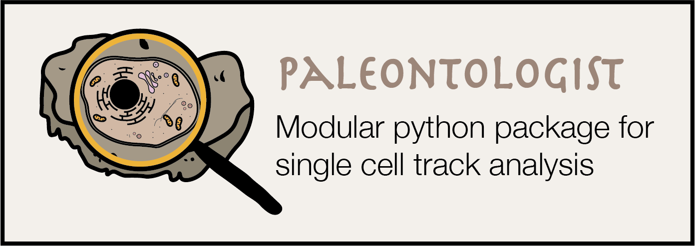
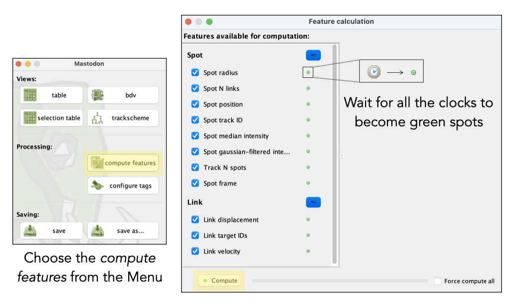
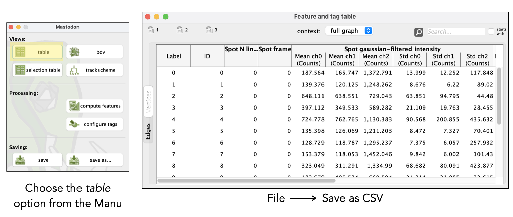

# Paleontologist

<p align="center">
 
</p>

This repository contains the documentation and code for running Paleontologist to allow you to read and analyse Mastodon (FIJI Plugin) .csv and .xml data.

[Mastodon](https://github.com/fiji/TrackMate3) is a large-scale tracking and track-editing framework for large, multi-view images. It allows you to track cells' dynamics over time and has a very useful and easy to use GUI. In order to use Mastodon, since it works with [Big Data Viewer](https://github.com/bigdataviewer), you need your data to be in HDF5/xml format. 

As an output, Mastodon provides either a -mamut.xml or a .csv file which containes, among many features, the XYZ coordinates of each cell and the 3D average intensity of the cells. This package provides the  tools to facilitate the organization of the data and enable the easy creation of figures for spatial, temporal and mitotic dynamics of the cells. 

## Table of contents
<a id='toc'></a>

- [Installation](#install)
  - [Anaconda and Jupyter notebooks/lab](#install1)
  - [Package installations](#install2)
  - [Run Paleontologist](#install3)
- [Data preparation](#dataprep)
  - [Obtaining XMl-HDF5](#dataprep1)
  - [Obtaining cell tracks from Mastodon](#dataprep2)
- [Using Paleontologist](#paleo)
  - [Jupyter Notebooks and User interface](#paleo1)
  - Classes and functions
- [Frequently Asked Questions and Issues](#faq)

## Installation
<a id='install'></a>

### [1] Set up your computer using Anaconda and Jupyter notebooks
<a id='install1'></a>
Paleontologist comes with several example notebooks and a user interface which runs in Jupyter notebook or lab. Thus, we recomment setting up Anaconda as the python distribution. 

#### Install Anaconda Distribution
Anaconda is available for Linux, Mac and Windows. It comes with Python version 3, conda package manager (with the possibility to download form the 7500 packahes available), Anaconda Prompt (the command shell line) and Anaconda Navigator (the GUI). To download, visit the following [Link](https://www.anaconda.com/products/individual).

If you have any doubts or would like more information on how to get started with Anaconda, visit the following [Link](https://docs.anaconda.com/anaconda/user-guide/getting-started/).

Once isntalled, we can launch Anaconda Navigator.
- Windows: From the Start menu, click the Anaconda Navigator desktop app.
- Mac: From the Launchpad, click the Anaconda Navigator icon
- Linux: From a terminal window type ``anaconda-navigator``.

#### How to use Anaconda and Jupyter Notebooks
There are many tutorials online and we include a notebook called ```0-Installation-Guide.ipynb``` which does not contain code, only text to better explain the basics on how to get started. 

### [2] Package installations
<a id='install2'></a>
For this, open the terminal (in Mac or Linux) or the Anaconda Prompt (in Windows) and type the following lines colored in grey.

First, we will create an environment called ```paleo``` to avoid conflicts with other packages:

```conda create --name paleo```

```conda activate paleo```

Each time you want to use Paleontologist, you should activate the environment by writing the previous activation line. 
To know more about conda environments and how to manage them, visit the following [link](https://docs.conda.io/projects/conda/en/latest/user-guide/tasks/manage-environments.html).

Now that the environment is created, we install the packages by writing the following lines:

```conda install pip numpy matplotlib scipy pandas tqdm ipympl psutil```

```pip install jupyter untangle sklearn ipywidgets```

Now you should be good to go! 

### [3] Run paleontologist
<a id='install3'></a>

Any time you want to use Paleonthologist, you can open a terminal/command line/anaconda prompt, access the folder were you have the Paleonthologist folder and then activate the environment.

``conda activate paleonthologist``

And then open jupyter notebook, so you can start using the Notebooks. 

``jupyter notebook`` 


## Data preparation
<a id='dataprep'></a>

### [1] Conversion to HDF5 and XML
<a id='dataprep1'></a>
Before using Mastodon, you need to convert your files in a format that BigData viewer can read. For this, using either [Big Data Viewer](https://github.com/bigdataviewer), [BigStitcher](https://imagej.net/BigStitcher) or [Multiview Reconstruction](https://imagej.net/Multiview-Reconstruction) from Fiji, you can convert your data into HDF5 and XML. HDF5 will save the raw data whereas the XML file will save the metadata and any transformation performed to the raw data. 

### [2] Obtaining cell tracks from Mastodon
<a id='dataprep2'></a>
[Mastodon](https://github.com/fiji/TrackMate3) is a very user-friendly Tracking plugin from Fiji. It allows interactive visualization and navigation of large images thanks to the BigDataViewer. Any file that can be opened in the BigDataViewer will work in Mastodon (BDV HDF5 file format, KLB, Keller-Lab Blocks file format, N5 file format, ...). 

With Mastodon you will be able to track large amount of cells in a manual, semi-automatic or automatic way. The outputs from the tracking are two .csv files: name-edges.csv and name-vertices.csv . The first one contains the information obtained from the spots: mean, median and standard deviation of intensity of all the channels; x, y, z coordinates of the centroid of the spots; spots radius; detection quality for each spot; tags and sub-tags for the spots; the individual ID for each spot; the track ID to which each spot corresponds. 


Once you have finished the tracking and you want to check the cell traces, the first step is to **Compute the Features** from the Mastodon Menu in order to extract the spots intensity, XYZ coordinates of the centroid, spots IDs, etc.
<p align="center">
 
</p>
 
Once the feature calculation is over (all the clocks became green spots), you can create the table which will then be saved as a .csv file with all the computed features. 

<p align="center">
 
</p>

Save the .csv file and to run this notebook you will then need to specify the path and the file name to start inspecting the traces. 

## Using Paleontologist
<a id='paleo'></a>
Paleontologist is a collection of modular python scripts and notebooks to organize the data coming from cell tracks to later perform the analysis needed. There are python scripts (.py) which will be arranging the data under the hood and the jupyter notebooks (.ipynb) which contain the interactive features and examples on how to call the different functions. 
 
The python scripts arranging the data are divided into 3:

### Jupyter Notebooks and User Interface
<a id='paleo1'></a>

### Functions and classes
<a id='paleo2'></a>
## ```paleo.py```:
Inside this package we have all the classes to call the ineractive features of Paleontologist. Among them we have: 

* ```AllTracks()```: Allows interactivity to check all ot big groups of cell tracks. The user interface includes all the necessary tools to change the figure axes, limits, size but more over, you can check all cell tracks to have a first approximation of how the data looks like. 

* ```IndividualTracks()```: This class allows the user to check each individual cell (all the channels) and even if the cells divide or not. This is the second level of checking the data in which you focus on what each individual cell is doing. 

* ```IndividualTracksNeighbours()```: This class is used to check for neighbourhood of cells (given a certan distance which can be tuned by the user) and observe the neighbouring cells even if they divide. 

* ```SpatialDivisionAnalysis()```: This class is used to check cell division both in space and time. We check how the sibling cells behave over time bu chechin their temporal dynamics e.g., the signal of a given channel and also, how far away from each other go after cell division.

* ```PeakDetectionAnalysis()```: This class allows the user to interactively change the parameters for peak detection. 

* ```PhaseAnalysis()```: This class applies a Butterworth filter (band-pass), a Hilbert transform and finally, calculates the phase of each individual cell.

*```Spatial3DAnalysis()```: This class allows the user to visualize the data using the 3 possible combinations of planes (XY, XZ and YZ) in order to check how the cells move over time. 


### ```mastodon_functions.py```:
This script contains 5 classes that will help you arrange the cell tracks obtained from Mastodon. 

*```xml_features():```
Gets as input the .xml file from the initial conversion using either BigdataViewer, Bigstitcher or Multiview reconstruction to convert the files into HDF5/XML. 
This class can be called by using the following line of code:

```python
fts = xml_features(path_xml)
```
where ```path_xml``` has the directory where the path of the .xml and .hdf5 files are. This line of code saves the output of the class xml_features into the object ```fts```. Therefore, if you write ```fts.``` and then press **Tab** you will get all possible outcomes from this class. The list of these outcomes are:
  - channels
  - dimensions
  - width
  - height
  - number of slices
  - x,y,z pixel size
  - coordinate units (microns, inches, etc.)

*```csv_reader```:
This class allows you to obtain all the information that comes in the .csv files (-vertices and -edges) that are generated with Mastodon once you have computed the features in Mastodon and saved the results in the .csv format. The file called name-vertices.csv contains all the information concerning each individual spot. The file called name-edges.csv contains all the information concerning the links of each spot. As a result, this class obtains all the features from each individual spot as a single unit and then they are rearranged according to their cell track. As a result, we obtain a new object called ```tracks```.

To call this class use the following line of code:
```python
tracks = csv_reader(path_csv, path_xml)
```
One advantage of using ```csv_reader``` over ```csv_features``` is that it keeps the data as DataFrames and only calls the tracks that the user specifies. Thus, if the dataset is very large, you should always use ```csv_reader``` because the data is kept in a tabular way and even though the access might be slower, it will avoid memory issues.

Using ```tracks``` we can access different features of the data:
  - ```tracks.data_df_sorted```: Is a ```pandas``` [DataFrame( )](https://pandas.pydata.org/docs/reference/api/pandas.DataFrame.html) which contains all the intensity measures (mean, min, max, standard deviation, sum), the spots ID, the frames, the XYZ coordinates, the tags and subtags and the number of links. Most importantly, the DataFrame is arranged in a way such that the tracks have already being arranged by their tracks.  
  
  - ```tracks.edges_df_sorted```: Another ```pandas``` [DataFrame( )](https://pandas.pydata.org/docs/reference/api/pandas.DataFrame.html) but this time, it contains the spots ID of the target and source spot. These are the features used to reconstruct the tracks. They are listed here as informative but since the trackes provided are already arranged, there is not obvious use for this dataframe.
  
  - ```tracks.tags```: List with all the names of the tags assigned in Mastodon.
  
  - ```tracks.sub_tags```: List with all the subtags associated to each tags (listed in ```tracks.tags```) assigned in Mastodon.

* ```csv_features```:
This class is very similar to ```csv_features``` but in this case, the tracks are loaded into memory in the form of a python [dictionary](https://docs.python.org/3/tutorial/datastructures.html#dictionaries). A loading bar will tell you how much time there is left and how fast is the loading of the data progressing. This class is called by another which will arrange the cell tracks.

* ```ordering_tracks```: 
This class calls the ```csv_features``` to read the .csv and .xml files. Then, the data is arranged by cell track, tags and subtags, and whether they divide or not. 

To call this class use the following line of code:
```python
tracks = ordering_tracks(path_csv, path_xml)
```
Using this new object ```tracks``` we can access different data:

  - ```tracks.spots_features```: This dictionary contains the frames, spots IDs, Track IDs, XYZ coordintates and a division ID. This division ID helps you know which cell tracks are siblings. If the DivID is 0, it means that cell track did not divide. The DivID which have the same number means they come from the same parental line. 

  - ```tracks.n_tracks_divs```: Number of total tracks
  
  - ```tracks.n_division_tracks```: Number of tracks that have a cell division

## FAQ 
<a id='faq'></a>
If there is any question related to the source code or you found a bug, please feel free to [open an issue](https://github.com/bercowskya/paleontologist/issues). 

1. *Can I use Paleontologist for other tracking software?*
At the moment Paleontologist only support .csv files coming from Mastodon. However, Mastodon can read files from [TGMM](https://biii.eu/3d-cell-tracking-using-gaussian-mixture-model-tgmm), [MaMuT](https://imagej.net/plugins/mamut/) and [Simi-BioCell](http://simi.com/en/products/cell-research), which can then be exported as .csv files which can be read by Paleontologist. 

2. * What Mastodon versions are supported by Paleontologist?*
Versions 19 and above. 


